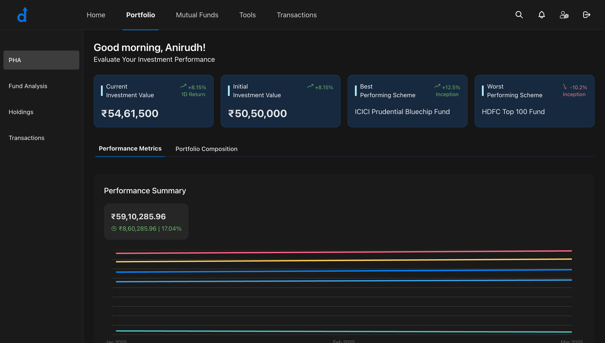

# Investment Portfolio Dashboard

 <!-- Add a screenshot here -->

A modern investment portfolio dashboard built with Next.js, Supabase, and Chart.js. Track your investments, analyze performance metrics, and visualize portfolio composition with responsive and interactive charts.

## Features

- **Performance Metrics**: Interactive line chart showing portfolio growth over time (3M, 6M, 1Y, 3Y, 5Y).
- **Portfolio Composition**: Visual breakdown by market cap, sectors, and individual stocks.
- **Real-time Data**: Powered by Supabase PostgreSQL database.
- **Skeleton Loading**: Animated loading states for smooth UX.
- **Key Metrics**:
    - Current/Initial Investment Values
    - Best/Worst Performing Funds
    - Absolute Returns & Percentage Growth

## Tech Stack

**Frontend:**
- Next.js 15 (App Router)
- TypeScript
- Tailwind CSS
- Shadcn UI Components
- Chart.js + react-chartjs-2

**Backend:**
- Supabase (PostgreSQL Database)
- Supabase JS Client

**Utilities:**
- React Icons
- Date-fns

## Setup Instructions

1. **Clone Repository**
```bash
git clone https://github.com/Anirudh-2903/fintech-project.git
cd fintech-project
```
2. **Install Dependencies**
```bash
npm install --legacy-peer-deps
```

3. **Environment Variables**
- Create .env.local file:
```bash
NEXT_PUBLIC_SUPABASE_URL=your_supabase_url
NEXT_PUBLIC_SUPABASE_ANON_KEY=your_supabase_anon_key
```
4. **Run Development Server**
```bash
npm run dev
```
